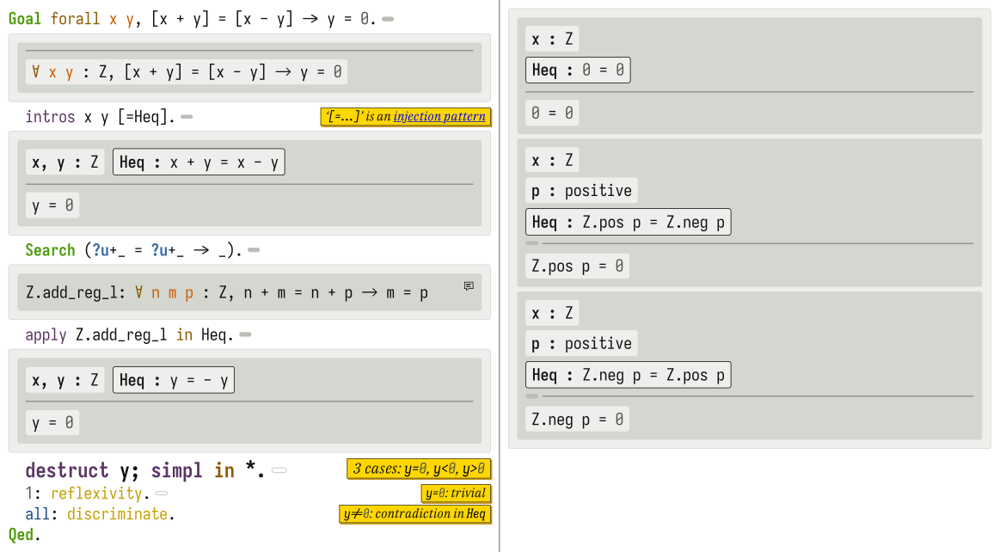

===========
 Alectryon
===========

A library to process Coq snippets embedded in documents, showing goals and messages for each Coq sentence.  Also a literate programming toolkit for Coq.  The goal of Alectryon is to make it easy to write textbooks, blog posts, and other documents that mix Coq code and prose.

Alectryon is typically used in one of three ways:

- As a library, through its Python API

- As a Docutils/Sphinx extension, allowing you to include annotated snippets into your reStructuredText and Markdown documents.  During compilation, Alectryon collects all ``.. coq::`` code blocks, feeds their contents to Coq, and incorporates the resulting goals and responses into the final document.

- As a standalone compiler, allowing you to include prose delimited by special ``(*| … |*)`` comments directly into your Coq source files (in the style of coqdoc).  When invoked, Alectryon translates your Coq file into a reStructuredText document and compiles it using the standard reStructuredText toolchain.

For background information, check out the  `quickstart guide <https://plv.csail.mit.edu/blog/alectryon.html>`__ on the MIT PLV blog, the `SLE2020 paper <https://doi.org/10.1145/3426425.3426940>`__ (open access) and its `live examples <https://alectryon-paper.github.io/>`__, or the `conference talk <https://www.youtube.com/watch?v=f8CKGoP3_us>`__.

Alectryon is free software under a very permissive license.  If you use it, please remember to `cite it <CITATION.bib>`__, and please let me know!

Some examples of use in the wild are linked `at the bottom of this page <gallery_>`_.  Please add your own work by submitting a PR!

Setup
=====

To install from OPAM and PyPI:
    | ``opam install "coq-serapi>=8.10.0+0.7.0"`` (from the `Coq OPAM archive <https://coq.inria.fr/opam-using.html>`__)
    | ``python3 -m pip install alectryon``

**A note on dependencies**: the core library only depends on ``coq-serapi`` from OPAM.  ``dominate`` is used in ``alectryon.html`` to generate HTML output, and ``pygments`` is used by the command-line application for syntax highlighting.  reStructuredText support requires ``docutils`` (and optionally ``sphinx``); Markdown support requires ``myst_parser`` (`docs <https://myst-parser.readthedocs.io/en/latest/index.html>`__); Coqdoc support requires ``beautifulsoup4``.  Support for Coq versions follows SerAPI; Coq ≥ 8.10 works well and ≥ 8.12 works best.

Usage
=====

As a standalone program
-----------------------

Recipes
~~~~~~~

Try these recipes in the ``recipes`` directory of this repository (for each task I listed two commands: a short one and a longer one making everything explicit):

Generate an interactive webpage from a literate Coq file with reST comments (Coqdoc style)::

      alectryon literate_coq.v
      alectryon --frontend coq+rst --backend webpage literate_coq.v -o literate_coq.html

Generate an interactive webpage from a plain Coq file (Proof General style):
   .. code::

      alectryon --frontend coq plain.v
      alectryon --frontend coq --backend webpage plain.v -o plain.v.html

Generate an interactive webpage from a Coqdoc file (compatibility mode):
   .. code::

      alectryon --frontend coqdoc coqdoc.v
      alectryon --frontend coqdoc --backend webpage coqdoc.v -o coqdoc.html

Generate an interactive webpage from a reStructuredText document containing ``.. coq::`` directives (coqrst style):
   .. code::

      alectryon literate_reST.rst
      alectryon --frontend rst --backend webpage literate_reST.rst -o literate_reST.html

Generate an interactive webpage from a Markdown document written in the `MyST <https://myst-parser.readthedocs.io/en/latest/index.html>`__ dialect, containing ``.. coq::`` directives:
   .. code::

      alectryon literate_MyST.md
      alectryon --frontend md --backend webpage literate_MyST.md -o literate_MyST.html

Translate a reStructuredText document into a literate Coq file:
   .. code::

      alectryon literate_reST.rst -o literate_reST.v
      alectryon --frontend rst --backend coq+rst literate_reST.rst -o literate_reST.v

Translate a literate Coq file into a reStructuredText document:
   .. code::

      alectryon literate_coq.v -o literate_coq.v.rst
      alectryon --frontend coq+rst --backend rst literate_coq.v -o literate_coq.v.rst

Record goals and responses for fragments contained in a JSON source file:
   .. code::

      alectryon fragments.json
      alectryon --frontend json --backend json fragments.json -o fragments.io.json

Record goals and responses and format them as HTML for fragments contained in a JSON source file:
   .. code::

      alectryon fragments.json -o fragments.snippets.html
      alectryon --frontend json --backend snippets-html fragments.json -o fragments.snippets.html

Command-line interface
~~~~~~~~~~~~~~~~~~~~~~

.. code::

   alectryon [-h] […]
             [--frontend {coq,coq+rst,coqdoc,json,md,rst}]
             [--backend {coq,coq+rst,json,latex,rst,snippets-html,snippets-latex,webpage,…}]
             input [input ...]

Use ``alectryon --help`` for full command line details.

- Each ``input`` file can be ``.v`` (a Coq source file, optionally including reStructuredText in comments delimited by ``(*| … |*)``), ``.json`` (a list of Coq fragments), ``.rst`` (a reStructuredText document including ``.. coq::`` code blocks), or ``.md`` (a Markdown/MyST document including ``{coq}`` code blocks).  Each input fragment is split into individual sentences, which are executed one by one (all code is run in a single Coq session).

- One output file is written per input file.  Each frontend supports a subset of all backends.

  * With ``--backend webpage`` (the default for most inputs), output is written as a standalone webpage named ``<input>.html`` (for ``coq+rst`` inputs) or ``<input>.v.html`` (for plain ``coq`` inputs).
  * With ``--backend snippets-html``, output is written to ``<input>.snippets.html`` as a sequence of ``<pre class="alectryon-io">`` blocks, separated by ``<!-- alectryon-block-end -->`` markers (there will be as many blocks as entries in the input list if ``input`` is a ``.json`` file).
  * With ``--backend json``, output is written to ``<input>.io.json`` as a JSON-encoded list of Coq fragments (as many as in ``input`` if ``input`` is a ``.json`` file).  Each fragment is a list of records, each with a ``_type`` and some type-specific fields.  Here is an example:

    Input (``minimal.json``):
        .. code-block:: json

           ["Example xyz (H: False): True. (* ... *) exact I. Qed.",
            "Print xyz."]

    Output (``minimal.json.io.json``) after running ``alectryon --writer json minimal.json``:
        .. code-block:: js

           [ // A list of processed fragments
             [ // Each fragment is a list of records
               { // Each record has a type, and type-specific fields
                 "_type": "sentence",
                 "sentence": "Example xyz (H: False): True.",
                 "responses": [],
                 "goals": [ { "_type": "goal",
                              "name": "2",
                              "conclusion": "True",
                              "hypotheses": [ { "_type": "hypothesis",
                                                "name": "H",
                                                "body": null,
                                                "type": "False" } ] } ] },
               {"_type": "text", "string": " (* ... *) "},
               {"_type": "sentence", "sentence": "exact I.", "responses": [], "goals": []},
               {"_type": "text", "string": " "},
               {"_type": "sentence", "sentence": "Qed.", "responses": [], "goals": []} ],
             [ // This is the second fragment
               { "_type": "sentence",
                 "sentence": "Print xyz.",
                 "responses": ["xyz = fun _ : False => I\n     : False -> True"],
                 "goals": [] } ] ]

As a library
------------

Use ``alectryon.core.annotate(chunks: List[str])``, which returns an object with the same structure as the JSON above, but using objects instead of records with a ``_type`` field:

.. code-block:: python

    >>> from alectryon.core import annotate
    >>> annotate(["Example xyz (H: False): True. (* ... *) exact I. Qed.", "Print xyz."])
    [# A list of processed fragments
     [# Each fragment is a list of records (each an instance of a namedtuple)
      CoqSentence(sentence='Example xyz (H: False): True.',
                  responses=[],
                  goals=[CoqGoal(name='2',
                                 conclusion='True',
                                 hypotheses=[
                                     CoqHypothesis(name='H',
                                                   body=None,
                                                   type='False')])]),
      CoqText(string=' (* ... *) '),
      CoqSentence(sentence='exact I.', responses=[], goals=[]),
      CoqText(string=' '),
      CoqSentence(sentence='Qed.', responses=[], goals=[])],
     [# This is the second fragment
      CoqSentence(sentence='Print xyz.',
                  responses=['xyz = fun _ : False => I\n     : False -> True'],
                  goals=[])]]

The results of ``annotate`` can be fed to ``alectryon.html.HtmlGenerator(highlighter).gen()`` to generate HTML (with CSS classes defined in ``alectryon.css``).  Pass ``highlighter=alectryon.pygments.highlight_html`` to use Pygments, or any other function from strings to ``dominate`` tags to use a custom syntax highlighter.

As a docutils or Sphinx module
------------------------------

With blogs (Pelican, Nikola, Hugo, etc.)
~~~~~~~~~~~~~~~~~~~~~~~~~~~~~~~~~~~~~~~~

Include the following code in your configuration file to setup Alectryon's ``docutils`` extensions:

.. code-block:: python

    import alectryon.docutils
    alectryon.docutils.setup()

This snippet registers a ``.. coq::`` directive, which feeds its contents to Alectryon and displays the resulting responses and goals interleaved with the input and a ``:coq:`` role for highlighting inline Coq code.  It also replaces the default Pygments highlighter for Coq with Alectryon's improved one, and sets `:coq:` as the default role.  See |help(docutils)|_ for more information.

To ensure that Coq blocks render properly, you'll need to tell your blogging platform to include ``alectryon.css``.  Using a git submodule or vendoring a copy of Alectryon is an easy way to ensure that this stylesheet is accessible to your blogging software.  Alternatively, you can use ``alectryon.html.copy_assets``.  Assets are stored in ``alectryon.html.ASSETS.PATH``; their names are in ``alectryon.html.ASSETS.CSS`` and ``alectryon.html.ASSETS.JS``.

By default, Alectryon's docutils module will raise warnings for lines over 72 characters.  You can change the threshold or silence the warnings by adjusting ``alectryon.docutils.LONG_LINE_THRESHOLD``.  With `Pelican <https://github.com/getpelican/pelican>`_, use the following snippet to make warnings non-fatal:

.. code-block:: python

   DOCUTILS_SETTINGS = {
       'halt_level': 3, # Error
       'warning_stream': None # stderr
   }

.. |help(docutils)| replace:: ``help(alectryon.docutils)``
.. _help(docutils): alectryon/docutils.py

I test regularly with Pelican; other systems will likely need minimal adjustments.

With Sphinx
~~~~~~~~~~~

For Sphinx, add the following to your ``conf.py`` file:

.. code-block:: python

   extensions = ["alectryon.sphinx"]

If left unset in your config file, the default role (the one you get with single backticks) will be set to ``:coq:``.  To get syntax highlighting for inline snippets, create a ``docutils.conf`` file with the `following contents <https://stackoverflow.com/questions/21591107/sphinx-inline-code-highlight>`_ along your ``conf.py`` file (see `below <docutils.conf_>`_ for details)::

   [restructuredtext parser]
   syntax_highlight = short

Setting options
~~~~~~~~~~~~~~~

Various settings are exposed as global constants in the docutils module:

- ``alectryon.docutils.LONG_LINE_THRESHOLD`` (same as ``--long-line-threshold``)
- ``alectryon.docutils.CACHE_DIRECTORY`` (same as ``--cache-directory``)
- ``alectryon.docutils.CACHE_COMPRESSION`` (same as ``--cache-compression``)
- ``alectryon.docutils.HTML_MINIFICATION`` (same as ``--html-minification``)
- ``alectryon.docutils.AlectryonTransform.SERTOP_ARGS`` (same as ``--sertop-arg``)

Controlling output
~~~~~~~~~~~~~~~~~~

The ``.. coq::`` directive takes a list of space-separated flags to control the way its contents are displayed:

- One option controls whether output is folded (``fold``) or unfolded (``unfold``).  When output is folded, users can reveal the output corresponding to each input line selectively.

- Multiple options control what is included in the output.
  - ``in``: Include input sentences (``no-in``: hide them)
  - ``goals``: Include goals (``no-goals``: hide them)
  - ``messages``: Include messages (``no-messages``: hide them)
  - ``out``: Include goals and messages (``no-out``: hide them)
  - ``all``: Include input, goals, and messages (``none``: hide them)

The default is ``all fold``, meaning that all output is available, and starts folded.  The exact semantics depend on the polarity of the first inclusion option encountered: ``x y z`` means the same as ``none x y z``, i.e. include ``x``, ``y``, ``z``, and nothing else; ``no-x no-y`` means ``all no-x no-y``, i.e. include everything except ``x`` and ``y``.

These annotations can also be added to individual Coq sentences (⚠ *sentences*, not lines), using special comments of the form ``(* .flag₁ … .flagₙ *)`` (a list of flags each prefixed with a ``.``):

.. code-block:: rst

   .. coq::

      Require Coq.Arith. (* .none *)      ← Executed but hidden
      Goal True. (* .unfold *)            ← Goal unfolded
        Fail exact 1. (* .in .messages *) ← Goal omitted
        Fail fail. (* .messages *)        ← Error message shown, input hidden

More precise inclusion/exclusion is possible using the `marker-placement mini-language <marker-language_>`__ described below.  For example:

``-.h(Inhabited)``
  Hide all hypotheses that mention ``Inhabited``
``-.g#2.h#IHn``
  Hide hypothesis ``IHn`` in goal 2.
``-.g#2.h#*``
  Hide all hypotheses of goal 2.
``-.h#* .h#IHn``
  Show only hypothesis ``IHn``
``-.g#* .g#1 .g#3 .g{False}``
  Show only goals 1, 3, and any goal whose conclusion is ``False``.

**This feature is experimental**; the syntax might change.

.. _marker-language:

Referring to subparts of a proof (the marker-placement mini-language)
~~~~~~~~~~~~~~~~~~~~~~~~~~~~~~~~~~~~~~~~~~~~~~~~~~~~~~~~~~~~~~~~~~~~~

Each object in a proof (sentences, goals, messages, hypotheses, conclusions) can be referred to by giving a path that leads to it, written in CSS-inspired notation.  This makes it possible to selectively show, hide, or link to parts of the proof state.

In the example below, the markers ``[α]``, ``[β]``, and ``[γ]`` correspond to the paths listed below:

.. code-block:: coq

   Goal ∀ m n, m + n = n + m. [α]
     induction m; intros.
     - (* Base case *)
       【 n: ℕ ⊢ 0 + n = n + 0 [β] 】
       apply plus_n_O.
     - (* Induction *)
       【 m, n: ℕ; IHm: ∀ n: ℕ, m + n = n + m [γ]
          ⊢ S m + n = n + S m 】

- ``[α]``

  ``.s(Goal ∀)``
     Search for a sentence (``.s(…)``) by matching its contents.

- ``[β]``

  ``.s(Base case).ccl``
     Search for a sentence (``.s(…)``) matching ``Base case``, then match the conclusion (``.ccl``) of its first goal.

- ``[γ]``

  ``.s(Induction).h#IHm``
     Search for a sentence (``.s(…)``) matching ``Induction``, then match the hypothesis ``IHm`` by name  (``.h#…``) in the first goal.

  ``.s(Induction).g#1.h(m + n = n + m)``
     Search for a sentence (``.s(…)``) matching ``Induction``, select its first goal by number (``.g#…``), match the hypothesis ``IHm`` by searching for its contents (``.h(…)``).

The full architecture of a path is shown below for reference:

.. parsed-literal::

   .io#\ *name*                        ex: .io#\ **intro**
     A block of code whose name matches *name*.
   (.io is optional and defaults to the most recent code block.)

       .s(*pattern*)                  ex: .s(**Goal True**)
         Any sentence matching *pattern*.
       .s{*pattern*}                  ex: .s{**forall\*m\*n\*,**}
         Any sentence that completely matches *pattern*.

          .in
            The input part of the sentence.

          .msg(*str*)                 ex: .msg(**Closed under global context**)
            Any message whose text includes *str*.
          .msg{*pattern*}             ex: .msg{**\*[\*syntax\*]\***}
            Any message whose complete text matches *pattern*.

          .g#\ *id*                     ex: .g#\ **1**
            Goal number *id*.
          .g#\ *name*                   ex: .g#\ **base_case**
            The goal named *name* (`documentation <https://coq.inria.fr/refman/proofs/writing-proofs/proof-mode.html#coq:tacn.}>`__).
          .g(*str*)                   ex: .g(**True**)
            Any goal whose conclusion includes *str*.
          .g{*pattern*}               ex: .g{**\* ++ \* ++ \* = \***}
            Any goal whose complete conclusion matches *pattern*.
          (.g is optional and defaults to #1.)

              .ccl *|* .name
                The conclusion or name of the goal.

              .h#\ *name*               ex: .h#\ **IHn**
                 The hypothesis named *name*.
              .h(*str*)               ex: .h(**Permutation**)
                 Any hypothesis whose body or type includes *str*.
              .h{*pattern*}           ex: .h{**nat**}
                 Any hypothesis whose complete body or type matches *pattern*.

                  .type *|* .body *|* .name
                    The type or body or name of the hypothesis.

Plain search patterns (delimited by ``(…)``) are matched literally, anywhere in the term.  Other patterns (``{…}`` patterns and ``#…`` names) use ``fnmatch``-style `matching <https://docs.python.org/3/library/fnmatch.html>`__ (``?`` matches any character; ``*`` matches any sequence of characters; and ``[]`` matches a range of characters), and must match the whole term.  Hence:

- To match hypothesis ``H1`` but not ``H10`` nor ``IH1``, use ``.h#H1``.
- To match hypotheses of type nat, but not of type ``list nat`` or ``nat -> nat``, use ``.h{nat}``
- To match hypotheses whole type or body includes ``Permutation`` anywhere, use ``.h(Permutation)`` or ``.h{*Permutation*}``.
- Etc.

As long as the search term does not contain special characters (``*?[]``), a plain search (``(…)``) is the same as an fnmatch-style search with wildcards on both sides (``{*…*}``).

**This feature is experimental**; the syntax might change.

Extra roles and directives
~~~~~~~~~~~~~~~~~~~~~~~~~~

For convenience, alectryon includes a few extra roles and directives:

Markers and marker references
*****************************

The ``:mref:`` role (short for “marker reference”) can be used to point the reader to a sentence, a goal, or a hypothesis.  The argument is a search pattern written in the `marker-placement mini-language <marker-language_>`__; Alectryon locates the corresponding object in the input sent to the prover or in the prover's output, inserts a marker at that point, and replaces the reference with a link to that marker.

For example, the ``[γ]`` marker in the example above could be inserted using :literal:`:mref:\`.s(Induction).h#IHm\`` or :literal:`:mref:\`.s(Induction).g#1.h(m + n = n + m)\``.

By default markers refer to the most recent ``.. coq::`` block, but other blocks can be targeted by name by prepending ``.io#name`` to the argument of ``:mref:``.

Markers can be customized by setting the ``:counter-style:`` option on a custom role derived from ``:mref:``; for example, to use Devanagari numerals:

.. code-block::

   .. role:: dref(mref)
      :counter-style: ० १ २ ३ ४ ५ ६ ७ ८ ९

More details and examples are given in `<recipes/references.rst>`__.

**This feature is experimental**: the syntax might change.

Quoted references to goal fragments
***********************************

The `:mquote:` role is similar to `:mref:`, but it inserts a copy of the target instead of a link to it.  Targets may only be hypotheses, goal conclusions, or goal or hypothesis names.

For example, using :literal:`:mquote:\`.s(Induction).h#IHm.type\`` in the example above would print the type of ``IHm``, ``∀ n: ℕ, m + n = n + m`` whereas :literal:`:mref:\`.s(Induction).g#1.h(m + n = n + m).name\`` would produce only the name of the corresponding hypothesis, ``IHm``.

Links to Coq identifiers
************************

``:coqid:`` can be used to link to the documentation or definition of a Coq identifier in an external file.  Some examples:

- :literal:`:coqid:\`Coq.Init.Nat.even\`` → `Coq.Init.Nat.even <https://coq.inria.fr/library/Coq.Init.Nat.html#even>`__
- :literal:`:coqid:\`Coq.Init.Nat#even\`` → `even <https://coq.inria.fr/library/Coq.Init.Nat.html#even>`__
- :literal:`:coqid:\`a predicate <Coq.Init.Nat.even>\`` → `a predicate <https://coq.inria.fr/library/Coq.Init.Nat.html#even>`__
- :literal:`:coqid:\`Coq.Arith.PeanoNat#\`` → `Coq.Arith.PeanoNat <https://coq.inria.fr/library/Coq.Arith.PeanoNat.html#>`__
- :literal:`:coqid:\`a library <Coq.Arith.PeanoNat#>\`` → `a library <https://coq.inria.fr/library/Coq.Arith.PeanoNat.html#>`__
- :literal:`:coqid:\`Coq.Arith.PeanoNat#Nat.Even\`` → `Nat.Even <https://coq.inria.fr/library/Coq.Arith.PeanoNat.html#Nat.Even>`__
- :literal:`:coqid:\`a predicate <Coq.Arith.PeanoNat#Nat.Even>\`` → `a predicate <https://coq.inria.fr/library/Coq.Arith.PeanoNat.html#Nat.Even>`__

By default, ``:coqid:`` only knows how to handle names from Coq's standard library (that is, names starting with ``Coq.``, which get translated to links pointing to https://coq.inria.fr/library/).  To link to other libraries, you can add entries to ``alectryon.docutils.COQ_IDENT_DB_URLS``, a list of tuples containing a prefix and a templated URL.  The URL can refer to ``$modpath``, the part before the last ``#`` or ``.`` in the fully qualified name, and ``$ident``, the part after the last ``#`` or ``.``.  Here is an example::

   ("My.Lib", "https://your-url.com/$modpath.html#$ident")

Alternatively, you can inherit from ``:coqid:`` to define new roles.  The following defines a new ``:mylib:`` role, which assumes that its target is part of ``My.Lib``::

   .. role:: mylib(coqid)
      :url: https://your-url.com/My.Lib.$modpath.html#$ident

Caching
~~~~~~~

The ``alectryon.json`` module has facilities to cache the prover's output.  Caching has multiple benefits:

1. Recompiling documents with unchanged code is much faster, since Coq snippets do not have to be re-evaluated.
2. Deploying a website or recompiling a book does not require setting up a complete Coq development environment.
3. Changes in output can be inspected by comparing cache files.  Caches contain just as much information as needed to recreate input/output listings, so they can be checked-in into source control, making it easy to assess whether a Coq update meaningfully affects a document (it's easy to miss breakage or subtle changes in output otherwise, as when using the copy-paste approach or even Alectryon without caching).

To enable caching on the command line, chose a directory and pass it to ``--cache-directory``.  Alectryon will record inputs and outputs in individual JSON files (one ``.cache`` file per source file) in subdirectories of that folder.  You may pass the directory containing your source files if you'd like to store caches alongside inputs.

From Python, set ``alectryon.docutils.CACHE_DIRECTORY`` to enable caching.  For example, to store cache files alongside sources in Pelican, use the following code::

   import alectryon.docutils
   alectryon.docutils.CACHE_DIRECTORY = "content"

Tips
====

Prettification
--------------

Programming fonts with ligatures are a good way to display prettified symbols without resorting to complex hacks.  Good candidates include *Fira Code* and *Iosevka* (with the latter, add ``.alectryon-io { font-feature-settings: 'XV00' 1; }`` to your CSS to pick Coq-specific ligatures).

Passing arguments to SerAPI
---------------------------

When using the command line interface, you can use the ``-I``, ``-Q``, ``-R`` and ``--sertop-arg`` flags to specify custom SerAPI arguments, like this::

   alectryon -R . Lib --sertop-arg=--async-workers=4

When compiling reStructuredText documents, you can add custom SerAPI arguments in a docinfo section at the beginning of your document, like this:

.. code-block:: rst

   :alectryon/serapi/args: -R . Lib -I mldir

To set SerAPI's arguments for all input files, modify ``AlectryonTransform.SERTOP_ARGS`` in ``alectryon.docutils``.  Here's an example that you could use in a Sphinx config file::

   from alectryon.docutils import AlectryonTransform
   AlectryonTransform.SERTOP_ARGS = ["-Q", "/coq/source/path/,LibraryName"]

Note that the syntax of ``SERTOP_ARGS`` is the one of ``sertop``, not the one of
``coqc`` (https://github.com/ejgallego/coq-serapi/issues/215).

Adding custom keywords
----------------------

You can use ``alectryon.pygments.add_tokens`` to specify additional highlighting
rules, such as custom tactic names.  See |help(add_tokens)|_ for more details.

.. |help(add_tokens)| replace:: ``help(alectryon.pygments.add_tokens)``
.. _help(add_tokens): alectryon/pygments.py

When compiling reStructuredText documents, you can add per-document highlighting rules to the docinfo section at the beginning of your document, like this:

.. code-block:: rst

   :alectryon/pygments/tacn: intuition_eauto simplify invert
   :alectryon/pygments/tacn-solve: map_tauto solve_eq

Interactivity
-------------

Most features in Alectryon's HTML output do not require JavaScript, but extra functionality (including keyboard navigation) can be added by loading ``assets/alectryon.js`` (this is done by default).

Scripts needed to unminify documents produced with ``--html-minification`` (see `below <minification_>`_) are bundled into the generated HTML and do not need to be loaded separately.

Authoring support
-----------------

The ``etc/elisp`` folder of this directory includes an Emacs mode, ``alectryon.el``, which makes it easy to switch between the Coq and reStructuredText views of a document.

.. _docutils.conf:

Docutils configuration
----------------------

You can set Docutils settings for your single-page reST or Coq+reST documents using a ``docutils.conf`` file.  See the `documentation <https://docutils.sourceforge.io/docs/user/config.html>`__ or the `example <recipes/docutils.conf>`__ in ``recipes/``.  For example, the following changes ``latex-preamble`` for the XeTeX backend to custom fonts::

   [xetex writer]
   latex-preamble:
     \setmainfont{Linux Libertine O}
     \setsansfont{Linux Biolinum O}
     \setmonofont[Scale=MatchLowercase]{Fira Code}

You can also use the `DOCUTILSCONFIG` `environment variable <https://docutils.sourceforge.io/docs/user/config.html#configuration-files>`__ to force alectryon to use a specific configuration file.

.. _minification:

Reducing page and cache sizes (experimental)
--------------------------------------------

Proofs with many repeated subgoals can generate very large HTML files and large caches.  In general, these files compress very well — especially with XZ and Brotli (often over 99%), less so with GZip (often over 95%).  But if you want to save space at rest, the following options may help:

- ``--html-minification``:  Replace repeated goals and hypotheses in the generated HTML with back-references and use more succinct markup.  Minimal Javascript is included in the generated page to resolve references and restore full interactivity.  Typical results::

     4.4M List.html          24.8M Ranalysis3.html
     1.4M List.min.html       452K Ranalysis3.min.html

- ``--cache-compression``: Compress caches (the default is to use XZ compression).  Typical results::

     3.2M List.v.cache       21M Ranalysis3.v.cache
      66K List.v.cache.xz    25K Ranalysis3.v.cache.xz

From Python, use ``alectryon.docutils.HTML_MINIFICATION = True`` and ``alectryon.docutils.CACHE_COMPRESSION = "xz"`` to enable minification and cache compression.

A minification algorithm for JSON is implemented in ``json.py`` but not exposed on the command line.

Diffing compressed caches
-------------------------

Compressed caches kept in a Git repository can be inspected by `automatically decompressing them <https://www.git-scm.com/docs/gitattributes#_performing_text_diffs_of_binary_files>`__ before computing diffs::

   # In $GIT_DIR/config or $HOME/.gitconfig:
   [diff "xz"]
     binary = true
     textconv = xzcat

   # In .gitattributes:
   *.cache.xz diff=xz

Building without Alectryon
--------------------------

The ``alectryon.minimal`` Python module provides trivial shims for Alectryon's roles and directives, allowing you continue compiling your documents even if support for Alectryon stops in the future.

Including custom JS or CSS in Alectryon's output
------------------------------------------------

For single-page documents, you can use a ``.. raw::`` directive:

.. code:: rst

   .. raw:: html

      
      

      <link rel="stylesheet" href="rbt.css">
      

For documents with more pages, you can either move the ``.. raw`` part to a separate file and ``.. include`` it, or you can use a custom driver: create a new file ``driver.py`` and use the following:

.. code:: python

   import alectryon.html
   import alectryon.cli

   alectryon.html.ADDITIONAL_HEADS.append('<link rel="stylesheet" href="…" />')
   alectryon.cli.main()

But for large collections of related documents, it's likely better to use Sphinx (or some other similar engine).  In that case, you can use Sphinx' built-in support for additional JS and CSS: ``app.add_js_file(js)`` and ``app.add_css_file(css)``.

Special case: MathJax
~~~~~~~~~~~~~~~~~~~~~

MathJax is a JavaScript library for rendering LaTeX math within webpages.  Properly configuring it can be a bit tricky.

- If you just want to include math in reStructuredText or Markdown documents, docutils will generally do the right thing: it will generate code to load MathJaX from a CDN if you use the ``:math:`` role, and it leave that code out if you don't.

- If you want to render parts of your Coq code using MathJaX, things are trickier.  You need to identify which text to render as math by wrapping it into ``\( … \)`` markers; then add the ``mathjax_process`` class to the corresponding document nodes to force processing (otherwise MathJax ignores the contents of Alectryon's ``<pre>`` blocks); then trigger a recomputation.  See `<./recipes/mathjax.rst>`__ for an example and a more detailed discussion.

.. _gallery:

Gallery
=======

- Anton Trunov. `Introduction to Formal Verification course at CS Club <https://github.com/anton-trunov/csclub-coq-course-spring-2021>`__.
- Jean-Paul Bodeveix, Érik Martin-Dorel, Pierre Roux. `Types Abstraits et Programmation Fonctionnelle Avancée <https://github.com/pfitaxel/tapfa-coq-alectryon>`__.
- Li-yao Xia. `Tutorial: Verify Haskell Programs with hs-to-coq <https://www.cis.upenn.edu/~plclub/blog/2020-10-09-hs-to-coq/>`__.
- Silver Oak contributors. `Formal specification and verification of hardware, especially for security and privacy <https://project-oak.github.io/silveroak/demo/tutorial.html>`__.
- Philip Zucker. `Translating My Z3 Tutorial to Coq <https://www.philipzucker.com/translating-z3-to-coq/>`__.
- Li-yao Xia. `hakyll-alectryon: Hakyll extension for rendering Coq code using Alectryon <https://hackage.haskell.org/package/hakyll-alectryon>`__.
